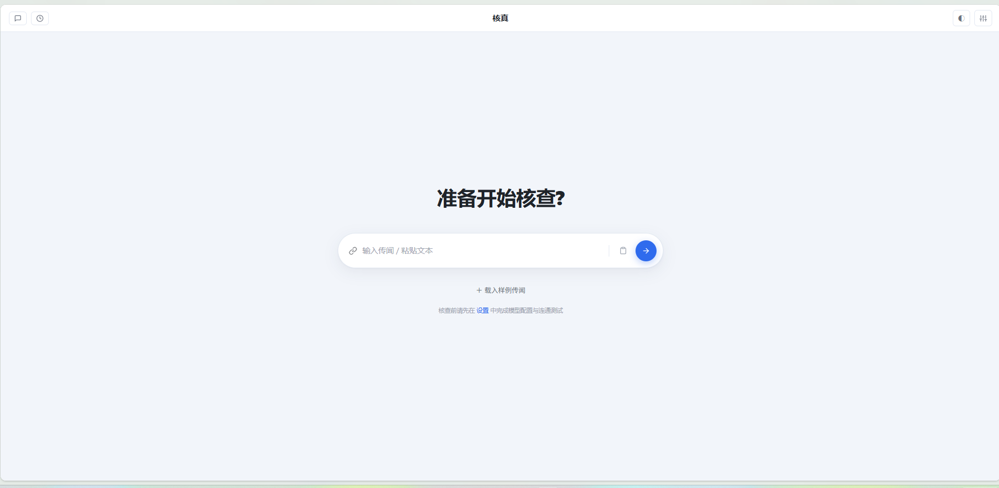
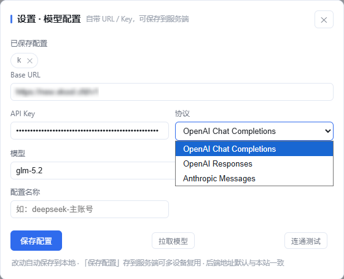
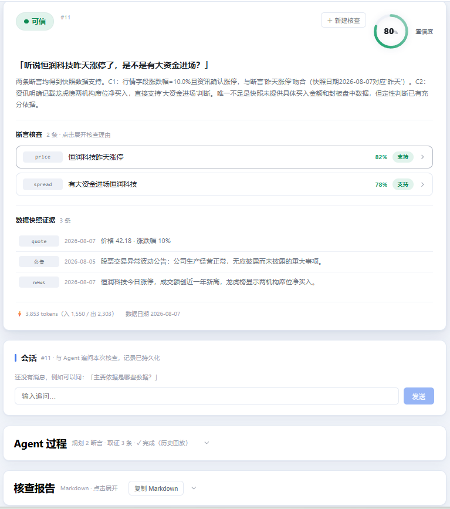
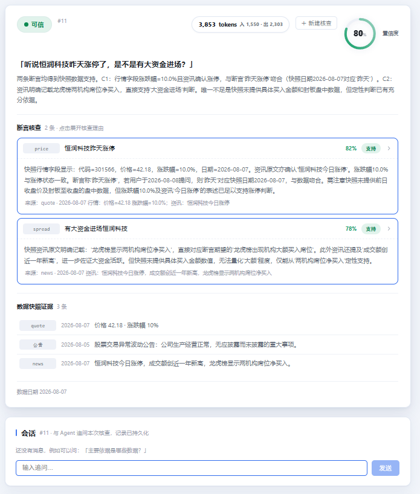
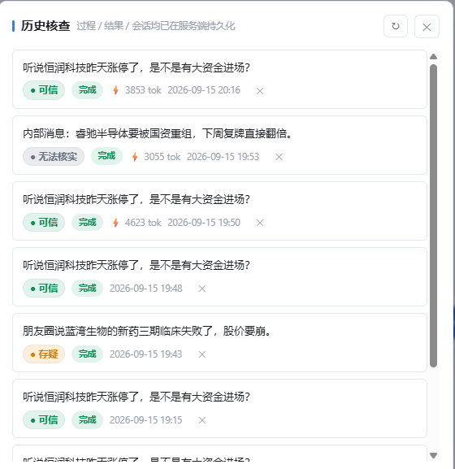
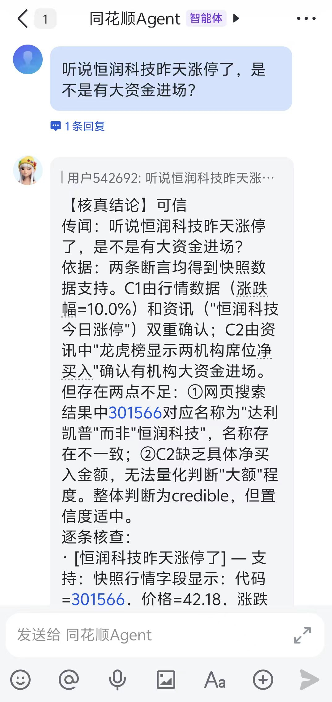

# 核真 Veritas · 市场传闻核查助手

用户转发一条股市传闻，Agent 调用行情/公告/资讯工具查证，输出「可信 / 存疑 / 无法核实」的判断、依据与数据来源。

## 技术栈

- **后端**：Python · FastAPI · LangGraph（planner → evidence → judge 三节点流水线）
- **LLM 接入**：自写三协议适配（OpenAI Chat Completions / Responses / Anthropic），用户自带 URL/Key
- **前端（真实接通）**：Vue 3 + Vite（`front/`），SSE 流式过程 + 结论导向结果页 + 会话追问 + 历史回放
- **前端（宣传展示）**：静态页（`frontend/`），部署 GitHub Pages，mock 数据
- **持久化**：SQLite（`backend/veritas.db`，已 gitignore）——模型配置 / 核查运行 / 过程事件 / 会话消息
- **数据**：题目本地虚构数据（A 股场景）+ 真实网络搜索（Perplexity 式网页来源带回，可选）

## 目录

| 目录 | 说明 |
|---|---|
| `backend/` | FastAPI + LangGraph 核查后端（含 SSE 流式接口）|
| `front/` | 真实接通前端（输入 + 流式过程 + 结果 + 报告）|
| `frontend/` | GitHub Pages 宣传展示页（mock）|
| `plan/` | AGENT.md 设计约束 · PRD · 开源项目调研笔记 |

## 运行

### 方式一：单脚本（题目要求入口）

```bash
# 编辑 编程题A-传闻核查.py 顶部三行（或设 LLM_BASE_URL / LLM_API_KEY / LLM_MODEL 环境变量）
python3 编程题A-传闻核查.py    # 依次核查 5 条 RUMORS 并输出结构化结果

# 单元测试（mock LLM，不联网、不消耗 token）
python3 test_传闻核查.py -v    # 50 个用例：重试/解析/兜底/边界输入
```

### 方式二：全栈应用

```bash
cd backend && uv sync && uv run uvicorn app:app --port 8000   # 后端
cd front && npm install && npm run dev                        # 前端 http://localhost:5173
# 页面：设置中填 URL/Key → 拉取模型 → 保存配置 → 首页输入传闻 → 核查
```

## 页面展示

**首页**（结论导向：判定徽章 + 置信度环 + 断言逐条展开）



**模型配置**（连接 OpenAI 兼容 API，支持拉取模型列表与多套配置保存）



**Agent 流式输出**（SSE 实时渲染核查过程：规划 → 取证 → 裁决）



**AI 输出结果**（结构化报告：依据 + 逐条核查 + 数据来源 + token 消耗）



**核查历史记录**（SQLite 持久化，含判定徽章与失败原因）



**接入飞书**（扫码授权 → 长连接接收 → 群内 @机器人触发核查）



## 题目要求对照

| 硬性要求 | 实现 |
|---|---|
| 判断基于工具数据、依据可复核 | judge 快照锚定：数值引用只能来自取证快照，逐条核查附 source/source_ref |
| 查不到明说「无法核实」 | judge 系统规则 + unverifiable 枚举，不编造 |
| 涉及几家查几家 | planner 识别全部公司（含间接指代），evidence 逐家取证 |
| 结构化输出（判断+依据+来源） | RumorCheckResult：final_verdict + basis + verifications + sources/web_sources |

## 已知缺陷

- planner 只能从题目候选公司清单选公司（防编造设计）；真实公司传闻需扩展候选库或放开约束。
- 真实网络搜索依赖网络环境：搜索引擎被屏蔽时自动降级为纯本地数据（可设 `TAVILY_API_KEY` 提质）。
- 后端依赖 `websockets<16`（langgraph_sdk 兼容上限），新增依赖时注意。
- LLM 输出偶发不规范：脚本与后端均有枚举兜底（从逐条判定推导最终结论），但无法 100% 消除。
- SQLite 为单文件库（含 API Key，勿外传），无并发写优化，仅适用单机 MVP。

## AI 协作过程

见 [docs/AI协作过程记录.md](docs/AI协作过程记录.md)。
